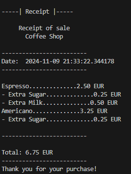

# Coffee Order System

This project is a simple Python program that allows users to order coffee, with the option to add extras (sugar or milk). The program generates a receipt summarizing the order at the end.

## Description

This program simulates the coffee ordering process, including the ability to add one serving of sugar or milk per beverage. It provides a detailed receipt with all orders and total costs.

### Features

- Choose from five different types of coffee.
- Add a maximum of one serving of sugar and/or milk per beverage.
- Simple text-based user interface for input.
- Neat receipt summary displaying all orders and their costs.


## Requirements

- Python 3.x

## Installation

1. Download or clone the repository.
2. Ensure Python 3.x is installed on your computer.
3. Run the script using the terminal or a Python IDE with the following command:

   ```bash
   python main.py
   ```

## Usage

1. Start the program and select a coffee option by entering a number (1-5).
2. Respond to whether you want to add extra sugar or milk.
3. Decide if you want to order another beverage.
4. At the end, view a detailed receipt with your orders and the total cost.



## Future Enhancements

- Ability for users to log in to the cash register system.
- Adding more drink options and extras.
- Integrating a graphical user interface (GUI).

## Scrum Board

### To-Do
- Implement user login functionality for the cash register system.
- Expand the available drink and extras menu.

### In Progress
- Enhancing the receipt display for better readability.

### Done
- Basic coffee ordering functionality.
- Adding sugar and milk options (one-time addition per beverage).
- Generating and printing a receipt with all orders.

## Contributions

Feel free to propose improvements via pull requests or provide feedback.
